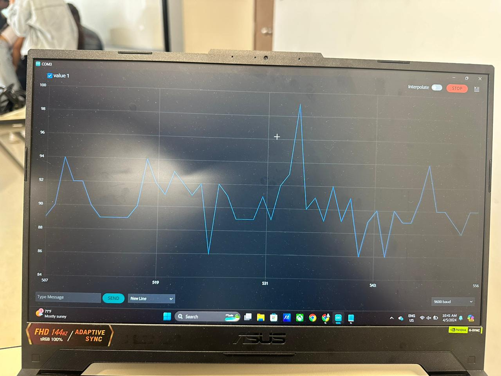
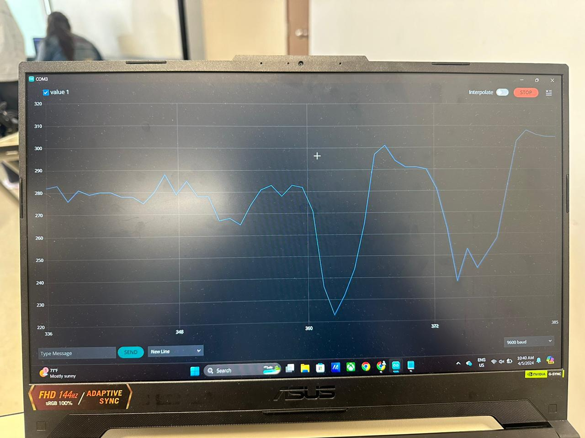

# LABORATORIO 2 – ADQUISICIÓN DE SEÑALES Y GRAFICACIÓN EN ARDUINO

### Integrantes del grupo 3

1. Ashley Estefania Bravo Bravo - ashley.bravo@upch.pe
2. Kevin Alexis Palomino Díaz - kevin.palomino@upch.pe
3. Sofia Natalia Sotelo Castillo - sofia.sotelo@upch.pe
4. Leonardo Nicolas Zuñiga - leonardo.zuniga@upch.pe

### Entregables

1. Plotear al menos 3 señales en Arduino IDE provenientes del generador de señales.
2. Comparar las señales graficadas del Arduino IDE con las gráficas obtenidas del osciloscopio.
3. Graficar en Arduino cloud.

### Configuracion inicial del osciloscopio
Para poder visualizar la onda sinusoidal primero utilizamos el botón “Autoset”. También utilizamos los controles de Posición Vertical, Horizontal y Disparo hasta obtener una correcta visualización de la onda sinusoidal.

<p align="center" style="margin-bottom:0">

<div align="center"> <i>Figura 1. Configuración Inicial del Osciloscopio</i></div>
<p>

### Configuracion inicial del generador de señales
<p>
Inicialmente utilizamos el generador de señales para proporcionar una señal sinusoidal de 1 KHz de frecuencia, 5V de Amplitud y 0V de offset, por el canal 1. La cual podemos apreciar en la <strong>Figura 1</strong>.
</p>

### Ploteo de 3 señales utilizando el generador de señales

Antes de iniciar a plotear con el Arduino, decidimos generar tres señales y visualizarlas en osciloscopio para poder verificar la funcionalidad del generador de señales.

<strong>-Conexiones:</strong>
 Para poder visualizar las ondas generadas primero conectamos un extremo del cable BNC en el canal 1 del generador de señales y el otro extremo en el canal 1 del osciloscopio.

<strong>-Mediciones:</strong>
 Para poder visualizar las mediciones de las ondas, utilizamos el botón “Measurements” y seleccionamos: frecuencia, voltaje pico pico, voltaje RMS, valor máximo y valor mínimo.

<strong>-Atenuación:</strong> Como sabemos la atenuación de la sonda se refiere a la relación entre la señal que llega a la punta de la sonda y la señal que se muestra en la pantalla del osciloscopio. Después de la primera configuración nos dimos cuenta que obteníamos 10Vpp en el osciloscopio cuando el generador de señales estaba dando 5Vpp. Para poder visualizar la señal correctamente en el osciloscopio tuvimos que utilizar una atenuación de 0.5X en el canal 1.

<p>
<strong><u>Primera señal</u></strong>:
</p>

<ul>
    <li>Forma de la señal : Sinusoidal</li>
    <li>Frecuencia : 1kHz</li>
    <li>Vpp : 5V</li>
    <li>Offset : 0V</li>
</ul>
<p align="center" style="margin-bottom:0">

<div align="center"> <i>Figura 2. Onda Sinusoidal</i></div>
<p>

<p>
<strong><u>Segunda señal</u></strong>:
</p>

<ul>
    <li>Forma de la señal : Cuadrada</li>
    <li>Frecuencia : 1kHz</li>
    <li>Vpp : 5V</li>
    <li>Offset : 0V</li>
</ul>
<p align="center" style="margin-bottom:0">

<div align="center"> <i>Figura 3. Onda Cuadrada</i></div>
</p>
<p>
<strong><u>Tercera señal</u></strong>:
</p>

<ul>
    <li>Forma de la señal : Triangular</li>
    <li>Frecuencia : 1kHz</li>
    <li>Vpp : 5V</li>
    <li>Offset : 0V</li>
</ul>
<p align="center" style="margin-bottom:0">

<div align="center"> <i>Figura 4. Onda Triangular</i></div>
</p>

### Conexión del Arduino NANO 33 IoT con la señal del generador de señales

<p>
<strong><u>Materiales</u></strong>:
</p>

<ul>
    <li>1 Protoboard</li>
    <li>1 Capacitor</li>
    <li>2 Cables Jumper</li>
    <li>1 Arduino NANO 33 IoT</li>
</ul>

En la <strong>Figura 5</strong> se muestran las conexiones que realizamos. En esta ocasión, utilizamos el pin analógico A0 del Arduino NANO 33 IOT, el cual conectamos al terminal positivo del capacitor y al generador de señales a través del cable jumper. Finalmente, cortocircuitamos el GND del Arduino con el GND del generador de señales y la pata negativa del capacitor.

<p align="center" style="margin-bottom:0">

<div align="center"> <i>Figura 5. Conexiones del Arduino NANO 33 IOT y el generador de señales</i></div>
</p>

### Código utilizado

````
void setup() {
  Serial.begin(9600);
}
void loop() {

    int r1 = analogRead(A0);
    Serial.println(r1);
    delay(100);
  }
````

### Ploteo de las señales en Arduino IDE provenientes del generador de señales

Primero, observamos que obtenemos cuando el generador de señales para poder identificar el ruido que estamos captando.

<p align="center" style="margin-bottom:0">

<div align="center"> <i>Figura 6. Ruido obtenido con el capacitor</i></div>
</p>

Notamos que obtenemos valores hasta de 150 . También, retiramos el capacitor para identificar el ruido que estamos captando sin este.

<p align="center" style="margin-bottom:0">

<div align="center"> <i>Figura 7. Ruido obtenido sin el capacitor</i></div>
</p>

Notamos que obtenemos valores hasta de 300

Como sabemos, los microcontroladores Arduino, en su forma básica, no tienen una capacidad intrínseca para "captar" frecuencias como lo haría un osciloscopio, es por eso que utilizamos frecuencias bajas para poder plotear correctamente.

<strong><u>Primera señal ploteada</u></strong>:

<ul>
    <li>Forma de la señal : Sinusoidal</li>
    <li>Frecuencia : 0.5 Hz</li>
    <li>Vpp : 500 mV</li>
</ul>
<p align="center" style="margin-bottom:0">

<div align="center"> <i>Figura 8. Onda sinusoidal ploteada en Arduino IDE</i></div>
</p>
<strong><u>Segunda señal ploteada</u></strong>:
<ul>
    <li>Forma de la señal : Cuadrada</li>
    <li>Frecuencia : 0.5 Hz</li>
    <li>Vpp : 500 mV</li>
</ul>
<p align="center" style="margin-bottom:0">

<div align="center"> <i>Figura 9. Onda cuadrada ploteada en Arduino IDE</i></div>
</p>
<strong><u>Tercera señal ploteada</u></strong>:

<ul>
    <li>Forma de la señal : Triangular</li>
    <li>Frecuencia : 0.5 Hz</li>
    <li>Vpp : 500 mV</li>
</ul>
<p align="center" style="margin-bottom:0">

<div align="center"> <i>Figura 10. Onda triangular ploteada en Arduino IDE</i></div>
</p>

### Discusión de Resultados

Podemos notar diferencias importantes entre observar señales generadas en un osciloscopio ( <i>Figura 2, Figura 3 y Figura 4</i> ) y ploteadas en la Arduino IDE ( <i>Figura 8, Figura 9 y Figura 10</i> ).

La primera y más notoria diferencia es la resolución y precisión. Como sabemos los osciloscopios suelen tener una resolución y precisión mucho mayores que las capacidades de visualización de la Arduino IDE. Los osciloscopios pueden mostrar señales con una mayor fidelidad y detalle. También es importante tener en cuenta el muestreo y conversión analógico-digital (ADC), los osciloscopios suelen tener ADC de alta velocidad y resolución para capturar y visualizar señales analógicas con precisión. Aunque las placas Arduino también tienen ADC, suelen tener limitaciones en términos de velocidad y resolución en comparación con los osciloscopios.

Finalmente, es importante resaltar que para poder visualizar resultados en el Arduino IDE, tuvimos que desconectar el capacitor. Para entender por qué tuvimos que hacer esto, primero vamos a mencionar que el capacitador estaba actuando como un filtro RC, donde el Arduino estaba funcionando como resistencia.

¿Qué es un filtro RC?
Un filtro RC es un circuito electrónico básico que utiliza una resistencia (R) y un condensador (C) para filtrar señales eléctricas. Funciona al pasar las señales a través del condensador, lo que permite el paso de frecuencias más bajas y bloquea las frecuencias más altas. La resistencia y el condensador juntos determinan la frecuencia de corte del filtro, es decir, la frecuencia a la que comienza a atenuar las señales. Esto lo hace útil para suavizar o eliminar el ruido de una señal, o para seleccionar frecuencias específicas en un circuito <strong>[1]</strong>.


Teniendo todo esto en cuenta podemos decir que la configuración del filtro RC, podría estar atenuando la señal de salida del generador de señales, haciendo que la amplitud de la señal sea demasiado baja para ser detectada correctamente por la entrada del Arduino. Otra posibilidad es que sii la frecuencia de corte del filtro RC es demasiado baja, podría estar atenuando las frecuencias de la señal generada por el generador de señales en Arduino IDE. Esto podría hacer que la señal filtrada sea difícil de detectar o interpretar correctamente. Y finalmente, los filtros RC pueden introducir un retraso en la señal debido al tiempo que tarda en cargarse y descargarse el condensador. Esto podría causar problemas de sincronización si estás tratando de leer señales rápidas o pulsos cortos generados por el Arduino.


### Bibliografia

1. “Todo lo que necesitas saber sobre Filtros RC”. Solectroshop -Tu tienda de Arduino, Raspberry, Micro:Bit, Sparkfun. Accedido el 6 de abril de 2024. [En línea]. Disponible: https://solectroshop.com/es/blog/todo-lo-que-necesitas-saber-sobre-filtros-rc-n52