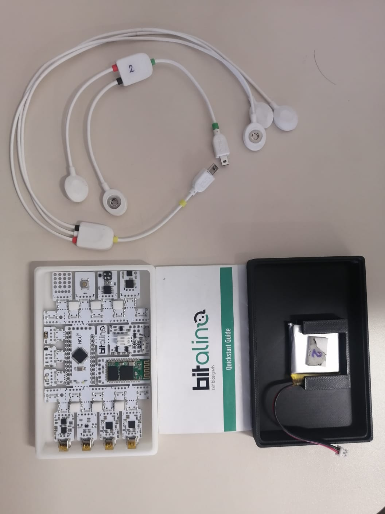
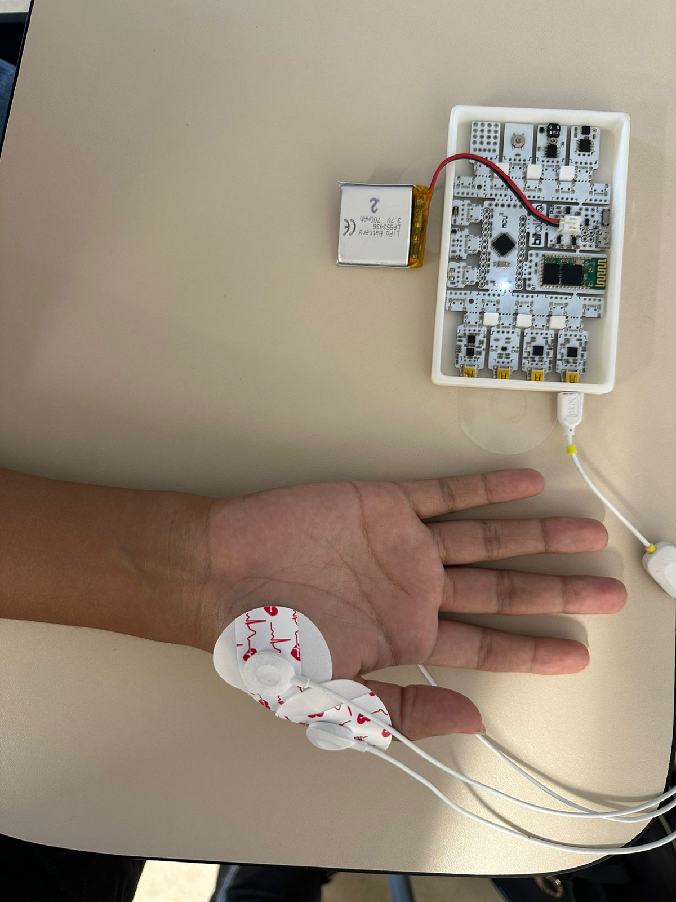
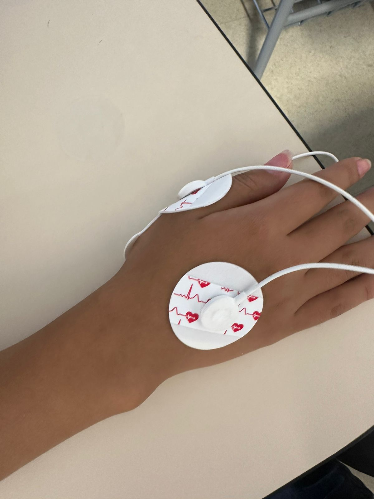

# LABORATORIO 3 – USO DE BITALINO PARA ADQUISICIÓN DE EMG

## CONTENIDO
* [Objetivos](#objetivos)
* [Introducción](#introducción)
* [Materiales](#materiales)
* [Laboratorio3](#laboratorio3)
  * [Conexiones](#conexiones)
  * [Videos de la señal](#videos-de-señal)
  * [Gráficos OpenSignals](#gráficos-opensignals)
  * [Ploteo en Python](#ploteo-en-python)
  * [Discusión](#discusión)
* [Bibliografía](#bibliografía)

## OBJETIVOS
* Adquirir correctamente una señal de EMG.
* Realizar una correcta configuración del BITalino
* Extraer la información de las señal del EMG mediante el software OpenSignals (r)evolution. 
## INTRODUCCIÓN 

La electromiografía (EMG) es una técnica no invasiva que permite registrar la actividad eléctrica de los músculos. Esta actividad eléctrica, conocida como potencial de acción muscular (PAM), refleja la despolarización y repolarización de la membrana celular de las fibras musculares durante la contracción muscular. La EMG juega un papel crucial en el diagnóstico y seguimiento de diversas condiciones neuromusculares, así como en la investigación de la función muscular y el control del movimiento [1].

 Los diferentes tipos de señales EMG son: [2]

* Potencial de acción muscular (PAM): La señal EMG más fundamental es el PAM, que representa la despolarización y repolarización de una sola fibra muscular. Los PAM se caracterizan por su amplitud, duración y forma de onda, y su análisis permite evaluar la salud y la actividad de las fibras musculares individuales.

* Potencial de acción motor unitario (MUAP): Un MUAP representa la suma de los PAM de un grupo de fibras musculares inervadas por la misma motoneurona. Los MUAP se caracterizan por su amplitud, duración, forma de onda y patrón de reclutamiento, y su análisis permite evaluar la función de las unidades motoras, que son las unidades funcionales del sistema neuromuscular.

* Señal EMG compuesta: La señal EMG compuesta es una mezcla de MUAP de diferentes unidades motoras que se activan simultáneamente. Esta señal es más compleja que los PAM o MUAP individuales, y su análisis requiere técnicas de procesamiento de datos más sofisticadas. La señal EMG compuesta proporciona información general sobre la actividad muscular global, como la fuerza y la fatiga.

Asimismo, existen diversos métodos de captura de Señales EMG, los cuales son los siguientes : [2]

* Electrodos de superficie: Los electrodos de superficie se colocan sobre la piel, directamente sobre los músculos que se desean estudiar. Estos electrodos son relativamente fáciles de usar y no invasivos, pero pueden captar interferencias de otras fuentes eléctricas, como la piel o los músculos adyacentes.

* Electrodos de aguja: Los electrodos de aguja se insertan directamente en el músculo, lo que les permite captar señales EMG más precisas y menos propensas a interferencias. Sin embargo, este método es más invasivo y requiere mayor experiencia para su correcta aplicación.

* TeleEMG: La teleEMG utiliza tecnología inalámbrica para transmitir señales EMG a distancia. Esto permite realizar grabaciones EMG en entornos móviles o en pacientes con movilidad limitada. 

En el presente laboratorio, utilizaremos la plataforma BITalino para adquirir señales de EMG utilizando el procedimiento para el estudio de conducción nerviosa motora del nervio mediano del MINSA [3]. Las señales de EMG serán visualizadas en tiempo real utilizando el software OpenSignals y guardaremos la información de las señales obtenidas para poder plotearlas en Python.

## MATERIALES
<table border=1px>
    <tr>
        <th>
            
MATERIAL

        </th>
        <th>
            
CANTIDAD

        </th>
    </tr>
    <tr>
        <th>
             Kit BITalino
        </th>
        <th>
            
1
      
        </th> 
    </tr>
    <tr>
        <th>
             Laptop
        </th>
        <th>
            
1
  
        </th> 
    </tr>
    <tr>
        <th>
        Electrodos desechables
        </th>
        <th>
            
3
  
        </th>
    </tr>
</table>
En la sesión de laboratorio, se hizo uso del kit BITalino (r)evolution (Figura 1). Dentro del mismo se encuentra el board del BITalino, 1 cable de 3 hilos, 1 cable de 2 hilos, 5 electrodos, 1 bateria de polímero de litio de 500 mAh y una breve guía de usuario.

&nbsp;

 <i>Figura 1. Kit Bitalino</i>

## LABORATORIO
Como mencionamos anteriormente utilizaremos BITalino, que es una plataforma de hardware y software de bajo costo y código abierto que permite la adquisición de señales biomédicas, incluyendo EMG. La plataforma BITalino está compuesta por una placa de desarrollo, varios sensores y un software de adquisición y análisis de datos. La placa de desarrollo cuenta con un microcontrolador, conectividad Bluetooth y varios canales analógicos y digitales que permiten conectar una variedad de sensores. Los sensores BITalino incluyen sensores de ECG, EMG, EEG, acelerometría, fotopletismografía (PPG), temperatura, respiración y actividad electrodermal. El software de adquisición y análisis de datos permite visualizar las señales en tiempo real, guardar los datos para su posterior análisis y exportar los datos a diferentes formatos [4]. 

### Conexiones
Se utilizo el cable de 3 hilos con sus respectivos electrodos. Cada uno de estso electrodos representa positivo (rojo), tierra (negro) y referencia (blanco). Para realizar las conexiones nos basamos en el protocolo del MINSA  "DE ELECTROMIOGRAFÍA Y VELOCIDAD DE CONDUCCIÓN DE NERVIOS PERIFÉRICOS". En este caso, utilizamos especificamente la técnica del estudio de conducción nerviosa motora del nervio mediano [1].

Para iniciar colocamos el electrodo positivo (G1) sobre el centro del músculo abductor corto del pulgar y el electrodo de referencia (G2) eN la articulación metacarpo falángico del primer dedo. Así como observamos en la Figura 2. 

 <i>Figura 2: Posición del electrodo positivo y de referencia.</i>

 Finalmente, colocamos el electrodo de tierra en el dorso de la mano, como observamos en la Figura 3.

 <i>Figura 3:Posición del electro de tierra.</i>

Después de posicionar los electrodos, se estableció la conexión Bluetooth entre el BiTalino y OpenSignals para visualizar la señal deseada. Se llevaron a cabo 3 pruebas: Una con el músculo en reposo, otra tensionando el músculo sin oposición externa y la última tensionando el músculo con oposición externa.

### VIDEOS DE LA SEÑAL
En los próximos videos se exhiben las conexiones entre los electrodos y el cuerpo, así como la visualización de la señal en OpenSignals.

https://github.com/sofia-is-a-panda/ISB_2024_G3/assets/111579919/ed8fcd7f-e6f9-48fb-ae98-fa43f72851b1

https://github.com/sofia-is-a-panda/ISB_2024_G3/assets/111579919/36e0f52f-40ff-4a65-8dae-3484ee3c43c2

https://github.com/sofia-is-a-panda/ISB_2024_G3/assets/111579919/c4f1a116-822b-44a9-a205-c3708c55ebe7

## GRÁFICOS OpenSignals
### Señal en reposo:
Podemos ver que observamos un poco de ruido cuando el músculo se encuentra en reposo que es debido a la mala colocación del electrodo de referencia.

 <i>Figura 4: Gráfica en OpenSignals músculo en reposo.</i>

Señal en tensión:
Cuando el músculo empieza a hacer un poco de tensión, empezamos a notar señales.

 <i>Figura 5: Gráfica en OpenSignals músculo en tensión</i>

Señal en oposición:
Cuando el músculo se enfrenta a una oposición, en este caso una fuerza externa aplicada por un compañero, empezamos a notar señales más pronunciadas.

 <i>Figura 6: Gráfica en OpenSignals músculo en oposición</i>

### PLOTEO EN PYTHON
Las señales obtenidas en la sesión fueron recuperadas y procesadas en Python de 1 alumno, del cual se realizó 
* Lectura en reposo
* Lectura durante la tensión
* Lectura durante oposición

| Lectura en reposo | Lectura durante la tensión | Lectura durante oposición |
| :---      |   :---:  |   :---:  | 
| |  |  |
| :---      |   :---:  |   :---:  | 
| |  |  |

### DISCUSIÓN
Se llevó a cabo la captura de las señales eléctricas del músculo abductor corto del pulgar, como se mostró en las imágenes. Dado que se utilizaron electrodos superficiales, existe la posibilidad de que se hayan registrado diversos ruidos externos o señales ajenas al segmento mencionado, aunque para evitar dichos ruidos al momento de tomar las mediciones retiramos todos los aparatos electronicos y joyas de la voluntaria. A partir de este punto, se realizaron tres movimientos. El primero fue de relajación, en el cual las señales exhibieron una variación mínima, casi similar al silencio, como se puede observar en la imagen donde la señal permanece cerca de su centro, mostrando una baja amplitud que, a gran escala, parece casi una línea.

Posteriormente, se procedió a inducir una tensión prolongada del músculo mediante un arqueo del falange, manteniendo la contracción por unos segundos. Y por último, se realizó un movimiento de oposición, en el cual pudimos detectar señales de mayor amplitud.

## BIBLIOGRAFÍA
[1] “Electromiografía y estudios de conducción nerviosa,” Medlineplus.gov. [Online]. Available: https://medlineplus.gov/spanish/pruebas-de-laboratorio/electromiografia-y-estudios-de-conduccion-nerviosa/. [Accessed: 13-Apr-2024].

[2] “Electromiografía,” Mayoclinic.org, 21-May-2019. [Online]. Available: https://www.mayoclinic.org/es/tests-procedures/emg/about/pac-20393913. [Accessed: 13-Apr-2024].

[3] MINSA, GUÍA DE PROCEDIMIENTO DE ELECTROMIOGRAFÍA Y VELOCIDAD DE CONDUCCIÓN DE NERVIOS PERIFÉRICOS UNIDAD DE ATENCIÓN INTEGRAL ESPECIALIZADA
SUB UNIDAD DE ATENCION INTEGRAL ESPECIALIZADA PEDIÁTRICA Y SUB ESPECIALIDADES NEUROLOGIA PEDIATRICA. Disponible en: https://www.insnsb.gob.pe/docs-trans/resoluciones/archivopdf.php?pdf=2020/RD%20N%C2%B0%20000226-2020-DG-INSNSB%20Gu%C3%ADa%20Proced%20Electromiograf%C3%ADa_2020%203REV%20UGC%20CHN%2019.06.2020.pdf

[4] “BITalino Lab Guides (Home Guides) – Support PLUX Biosignals official,” support.pluxbiosignals.com. https://support.pluxbiosignals.com/knowledge-base/bitalino-lab-guides/. [Accessed: 13-Apr-2024].

